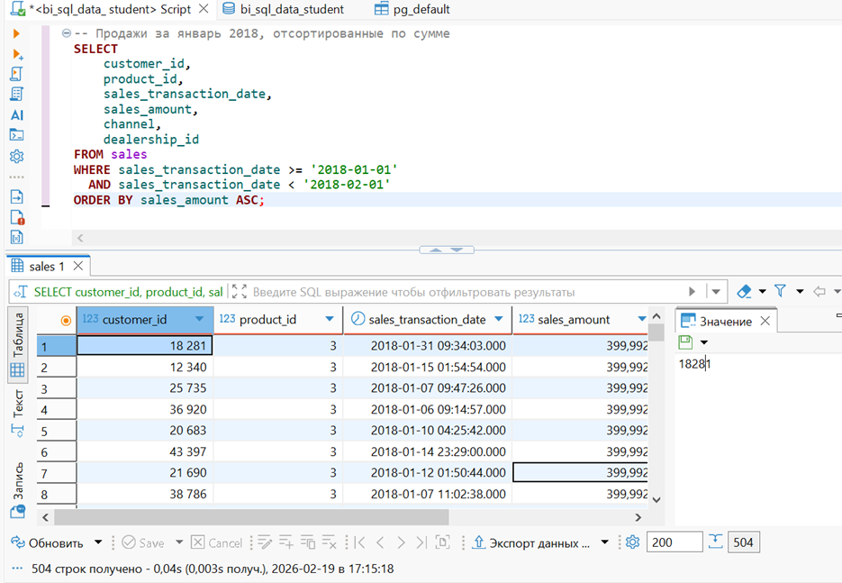
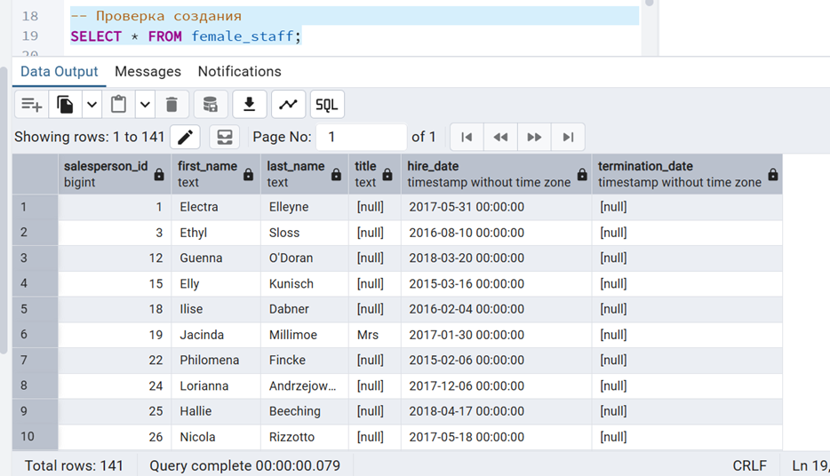
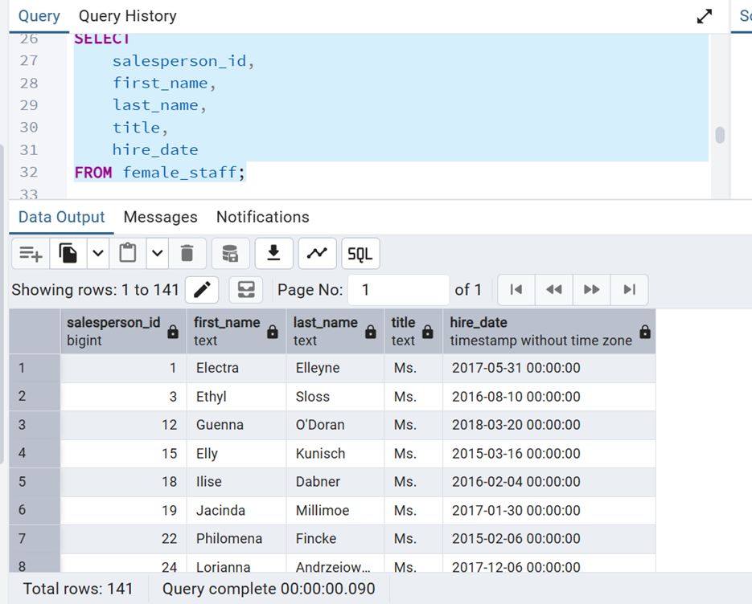
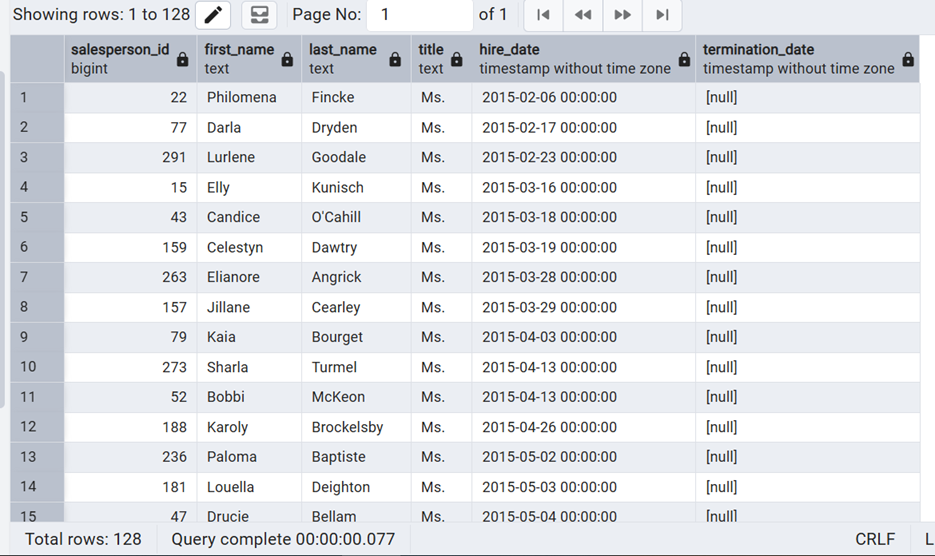

# Лабораторная работа №1: Формирование SQL-запросов (SELECT, CRUD)

**Вариант:** 14  
**Студент:** [Наумова Надя]  
---
## Задание 1 (Основной сервер): Продажи в январе 2018

**Текст задания:** Продажи (sales) в январе 2018 года. Сортировка: сумма (по возрастанию).

**Результат выполнения:**

*На скриншоте представлены продажи за январь 2018 года, отсортированные по возрастанию суммы.*

---

## Задание 2 (Основной сервер): Клиенты с IP на '192.'

**Текст задания:** Клиенты (customers) с ip-адресом, начинающимся на '192.'.

**Результат выполнения:**
 

*На скриншоте представлены клиенты, чьи IP-адреса начинаются с "192.", отсортированные по фамилии и имени.*

---

## Задание 3* (Локальная среда): Работа с таблицей female_staff

**Текст задания:** Таблица female_staff (женщины-продавцы). Титул -> 'Ms.'. Удалить нанятых до 2015.

**Результат создания таблицы female_staff**

**Результат обновления титула на 'Ms.':**

**Итоговый результат (после всех операций) Финальная проверка:**

---

## Используемые инструменты

- **СУБД:** PostgreSQL
- **Клиенты:** DBeaver (основной сервер), pgAdmin 4 (локальная среда)
- **Основной сервер:** Read-only доступ (задания 1 и 2)
- **Локальная среда:** Полный доступ (задание 3*)

---

## Вывод

В ходе выполнения лабораторной работы я:

1. **Научилсяась формировать SELECT-запросы:**
   - С фильтрацией по диапазону дат
   - С поиском по шаблону (LIKE)
   - С сортировкой результатов (ORDER BY ASC)

2. **Освоила CRUD-операции в локальной среде:**
   - `CREATE TABLE AS` - создание таблицы
   - `UPDATE` - массовое обновление данных
   - `DELETE` - удаление записей по условию
   - `SELECT` - проверка результатов

3. **Поработал(а) с двумя окружениями:**
   - Основной сервер (только чтение)
   - Локальная копия (полный доступ)

Все задания выполнены в соответствии с вариантом №14.

